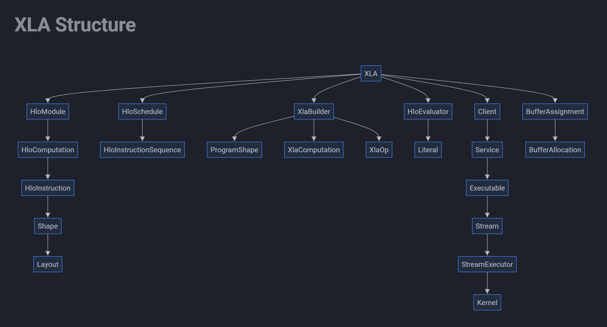
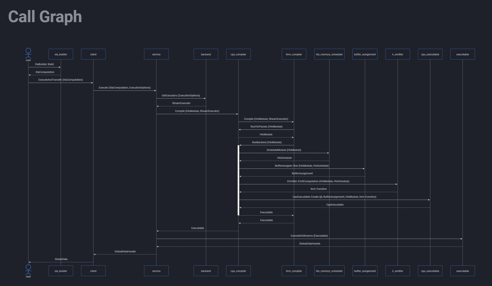

# My XLA Notes
[sagarjinde.github.io/mkdocs-xla](sagarjinde.github.io/mkdocs-xla)

These notes provide structural and functional overview on [XLA](https://github.com/openxla/xla) Compiler.

## Notes contain

### XLA Structure
This captures interaction between XLA classes.

Each class contains:
1. A small discription about the class
2. Attributes Overview
3. Functions Overview

### Call Graph
This captures the sequence of function calls during compilation

Happy Learning :)