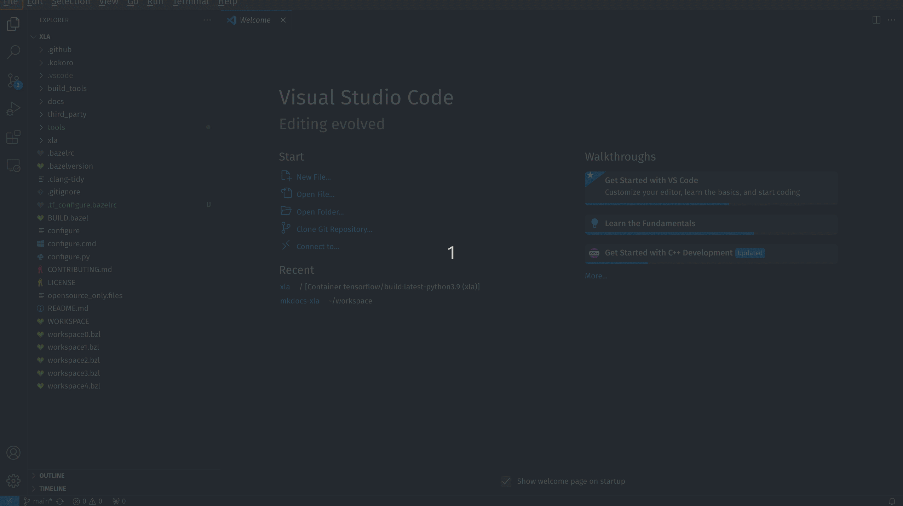

# **Setup Debugger**

### **Clone and build XLA**

To clone XLA
```
git clone https://github.com/openxla/xla.git
```
XLA uses docker. To create and configure xla docker
```
docker run --name xla -w /xla -it -d --rm -v $PWD:/xla tensorflow/build:latest-python3.9 bash
docker exec xla ./configure
```
This creates a docker container named ```xla```. To start this container
```
docker exec -it xla bash
```
Once inside container, to build XLA
```
bazel build --config=dbg --test_output=all --spawn_strategy=sandboxed //xla/...
```
Your XLA is now built.
!!! note
    Using ```--config=dbg``` flag to add debugging symbols. This flag is required by the debugger.

### **Compile a unit test**

Best way to learning about a codebase is to run its unit tests through debugger.

To compile a unit test
```
bazel test --config=dbg //xla/tests:tuple_test_cpu
```
This will create an executable
```
bazel-bin/xla/tests/tuple_test_cpu
```
Test it by executing it.

### **Setup Visual Studio Code**

I use VSCode debugger to debug the executable.

To debug in VSCode, install following extensions:

- C/C++
- C/C++ Extension Pack
- Dev Containers

Next, add the following lines to ```.vscode/launch.json```
``` hl_lines="7"
{
  "configurations": [
  {
    "name": "(gdb) Launch",
    "type": "cppdbg",
    "request": "launch",
    "program": "${workspaceFolder}/bazel-bin/xla/tests/tuple_test_cpu",
    "args": [],
    "stopAtEntry": false,
    "cwd": "${workspaceFolder}",
    "environment": [],
    "externalConsole": false,
    "MIMode": "gdb",
    "setupCommands": [
      {
        "description": "Enable pretty-printing for gdb",
        "text": "-enable-pretty-printing",
        "ignoreFailures": true
      }
    ]
  }
  ]
}
```

!!! note
    The line highlighted above says VSCode will run debugger on ```tuple_test_cpu```. You can replace ```"program"``` field with any executable you wish to debug.

Because XLA uses docker container to execute, we need to attach docker container to VSCode before hitting debug.

To attach a running container to VSCode, press ```Ctrl + Shift + P``` > type "attach to running container" > select your running xla container (the one that you had started by ```docker exec -it xla bash```).



Add breakpoints where required and press F5 to start debugging.

### **References**
To clone and build XLA: [https://github.com/openxla/xla/blob/main/docs/developer_guide.md](https://github.com/openxla/xla/blob/main/docs/developer_guide.md)

To setup debugger: [https://nekodaemon.com/2021/08/04/Easy-way-to-debug-TensorFlow-XLA-Compiler-using-VSCode/](https://nekodaemon.com/2021/08/04/Easy-way-to-debug-TensorFlow-XLA-Compiler-using-VSCode/)